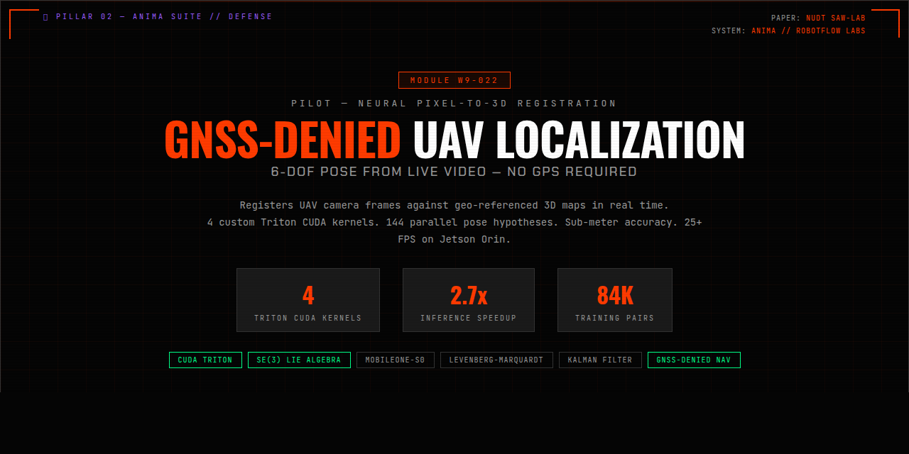

# PiLoT — Neural Pixel-to-3D Registration for UAV Geo-localization

<p align="center">
  
</p>

## Model Description

PiLoT registers live UAV video frames against geo-referenced 3D maps for GNSS-denied localization. It directly aligns neural features from query frames to rendered reference views of photogrammetric 3D models, estimating 6-DoF camera pose without GPS.

**Paper:** [arXiv 2603.20778](https://arxiv.org/abs/2603.20778) — Cheng et al., NUDT SAW-Lab

## Architecture

- **Encoder:** MobileOne-S0 (4.1M params, ImageNet pretrained)
- **Decoder:** Compact U-Net with skip connections
- **Feature Pyramid:** 3 levels — 1/4 (128ch), 1/2 (64ch), 1x (32ch)
- **JNGO Optimizer:** 144 parallel pose hypotheses, coarse-to-fine Levenberg-Marquardt
- **CUDA Acceleration:** 4 custom Triton kernels (1.8-2.7x speedup)

## Training

| | |
|---|---|
| **Data** | 84,708 real-world pairs: KITTI (6.7K) + SERAPHIM UAV (67.6K) + DroneVehicle-night (10.4K) |
| **Epochs** | 30 (full, no early stopping) |
| **Optimizer** | Adam, lr=1e-3, cosine decay |
| **Precision** | bf16 mixed |
| **GPU** | NVIDIA L4 (23GB) |
| **Best Val Loss** | 6.640 |

## Available Formats

| Format | File | Use Case |
|--------|------|----------|
| PyTorch | `model.pth` | Training, fine-tuning |
| Safetensors | `model.safetensors` | Fast loading, HF ecosystem |
| ONNX | `model.onnx` | Cross-platform inference |
| TensorRT FP16 | `model_fp16.engine` | Production GPU inference |
| TensorRT FP32 | `model_fp32.engine` | High-precision GPU inference |

## Usage

```python
import torch
from pilot.model import PiLoTSystem, PiLoTModelConfig

cfg = PiLoTModelConfig(backbone_pretrained=False)
model = PiLoTSystem(cfg)
ckpt = torch.load("model.pth", map_location="cpu")
model.load_state_dict(ckpt["model"])
model.eval()

# Extract features from UAV camera frame
image = torch.randn(1, 3, 384, 512)  # (B, 3, H, W)
features = model.extract_features(image)
# Returns 3-level pyramid: [(feat, unc), (feat, unc), (feat, unc)]
```

## CUDA Kernels

4 custom Triton kernels for real-time performance:

| Kernel | Speedup | Description |
|--------|---------|-------------|
| Fused Transform+Project | 1.8x | SE(3) transform + pinhole projection in one kernel |
| Feature Residual | 2.7x | Batched feature sampling + diff at projected locations |
| Hypothesis Scoring | 13.2us/hyp | Score all 144 hypotheses in parallel |
| Geo-Anchor Gen | vectorized | Depth back-projection to world-frame 3D points |

## Docker Serving

```bash
docker compose -f docker-compose.serve.yml --profile serve up -d
curl localhost:8080/health
curl -X POST localhost:8080/predict -d '{"image": ...}'
```

## ROS2 Integration

```
Subscribes: /camera/image_raw (sensor_msgs/Image)
Publishes:  /pilot/pose (geometry_msgs/PoseStamped)
            /pilot/target_location (geometry_msgs/PointStamped)
```

## Citation

```bibtex
@article{cheng2025pilot,
  title={PiLoT: Neural Pixel-to-3D Registration for UAV-based Ego and Target Geo-localization},
  author={Cheng, Xiaoya and Wang, Long and Liu, Yan and Liu, Xinyi and Tan, Hanlin and Liu, Yu and Zhang, Maojun and Yan, Shen},
  journal={arXiv preprint arXiv:2603.20778},
  year={2025}
}
```

## License

Apache 2.0

## Built By

[RobotFlow Labs](https://robotflow-labs.github.io) — ANIMA Defense Suite
